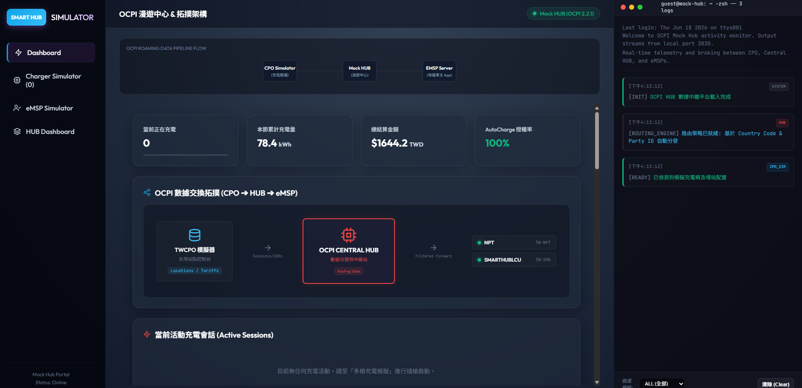
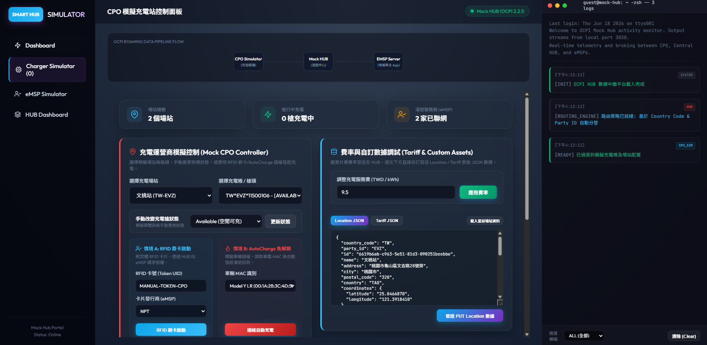
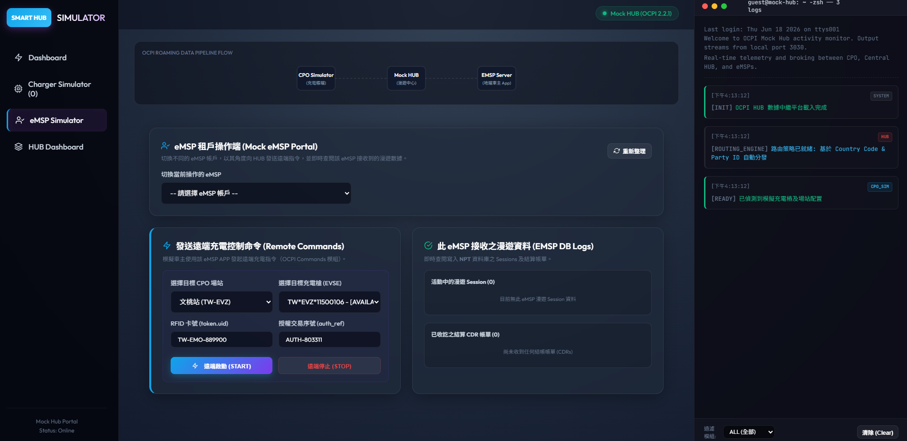
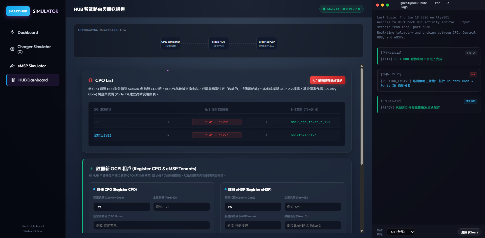

# Mock Hub 漫遊中繼平台 - 操作介面導覽與架構說明

[English Version](README_EN.md)

本專案提供了一個完整的 OCPI (Open Charge Point Interface) 模擬與漫遊中繼平台。透過此平台，您可以模擬充電營運商 (CPO)、智慧中繼站 (HUB) 與出行服務營運商 (eMSP) 之間的數據交換與控制流程。

---

## 系統拓撲與數據流

本平台核心模擬的數據交換流向如下：

```mermaid
graph TD
    subgraph 模擬充電站端 (CPO)
        CPO_SIM[Charger Simulator]
    end

    subgraph 數據中繼中樞 (HUB)
        CENTRAL_HUB[OCPI Central HUB]
        LOGS[Real-time Telemetry Logs]
    end

    subgraph 租戶接收端 (eMSP)
        EMSP_NPT[eMSP: NPT]
        EMSP_SH[eMSP: SMARTHUBLCU]
    end

    %% 數據傳輸方向
    CPO_SIM -->|1. Push Locations/Tariffs/Sessions/CDRs| CENTRAL_HUB
    CENTRAL_HUB -->|2. Route & Filtered Forward| EMSP_NPT
    CENTRAL_HUB -->|2. Route & Filtered Forward| EMSP_SH
    
    %% 控制命令方向
    EMSP_NPT -->|3. Remote Start/Stop Command| CENTRAL_HUB
    EMSP_SH -->|3. Remote Start/Stop Command| CENTRAL_HUB
    CENTRAL_HUB -->|4. Forward Command| CPO_SIM
```

---

## 介面功能導覽

### 1. 整體架構儀表板 (Dashboard)



* **核心功能**：展示整個 OCPI 漫遊網路的健康度、統計數據與當前活動拓撲。
* **主要區塊**：
  * **數據管線流程圖**：圖解 CPO Simulator -> Mock HUB -> eMSP Server 漫遊鏈路。
  * **統計看板**：包含當前正在充電槍數、本節累計充電量 (kWh)、網結算金額 (TWD) 以及 AutoCharge 的授權成功率。
  * **數據交換拓撲圖**：即時呈現 TWCPO 模擬器（台灣起點控制台）如何透過中繼站自動轉送 Sessions/CDRs 資料至指定的 eMSP 租戶（如 NPT 或 SMARTHUBLCU）。
  * **當前活動充電會話 (Active Sessions)**：顯示當前所有正在進行中的充電交易明細。
  * **右側即時日誌監控 (Real-time Logs)**：即時輸出 OCPI 協定的 HTTP 請求與路由引擎分流狀態。

### 2. 充電營運商模擬器 (Charger Simulator)



* **核心功能**：模擬 CPO 端的充電站實體運作，包括充電站狀態、刷卡認證與 AutoCharge 行為。
* **主要區塊**：
  * **站點與槍頭狀態控制**：可選擇特定站點（如「文桃站」）與特定的充電槍，並手動變更其狀態（例如將空閒 Available 變更為其他狀態）。
  * **情境 A：RFID 靠卡啟動**：手動輸入虛擬 RFID 卡號 (Token UID) 並選擇發卡商 eMSP，模擬用戶持卡在充電樁刷卡啟動充電的授權流程。
  * **情境 B：AutoCharge 免刷卡自動啟動**：模擬車主插槍後，充電樁讀取車輛 MAC 位址（如 Model Y LR 的 MAC）並自動向 HUB/eMSP 請求授權的「插槍即充」流程。
  * **費率與自訂數據調試**：可即時調整每度電費率 (TWD/kWh)，或直接編輯與發送該站點的 Location JSON 與 Tariff JSON 數據。

### 3. eMSP 租戶操作端 (eMSP Simulator)



* **核心功能**：模擬電動車主所使用的 App 後端，用以發送控制命令及接收漫遊帳單。
* **主要區塊**：
  * **切換 eMSP 帳戶**：可模擬不同 eMSP 租戶的視角，檢視該租戶特有的數據。
  * **發送遠端充電控制命令 (Remote Commands)**：
    * **遠端啟動 (Remote START)**：指定 CPO 站點與充電槍，並輸入卡號與授權序號，向 CPO 發送啟動充電指令。
    * **遠端停止 (Remote STOP)**：向進行中的充電會話發送停止指令。
  * **漫遊數據接收紀錄 (eMSP DB Logs)**：即時接收來自中繼站轉發的活動中會話 (Sessions) 與已結算之充電明細 (CDR)。

### 4. HUB 智慧路由與轉送通道 (HUB Dashboard)



* **核心功能**：設定與管理 OCPI 的租戶連接路由。
* **主要區塊**：
  * **CPO 列表與連線 Token**：展示當前已接入的 CPO，以及其對應的 Country Code + Party ID（例如 TW + CPO 或 TW + EVZ）與連線憑證。
  * **註冊新 OCPI 租戶**：可在此頁面動態註冊新的 CPO（充電營運商）或 eMSP（出行服務商），輸入國家代碼、企業代碼、租戶名稱與對接 Token，系統會自動在資料庫建立路由，讓新租戶能立刻參與漫遊數據交換。
